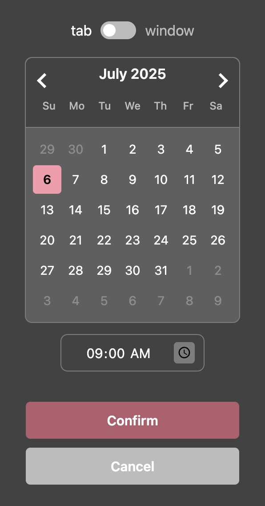
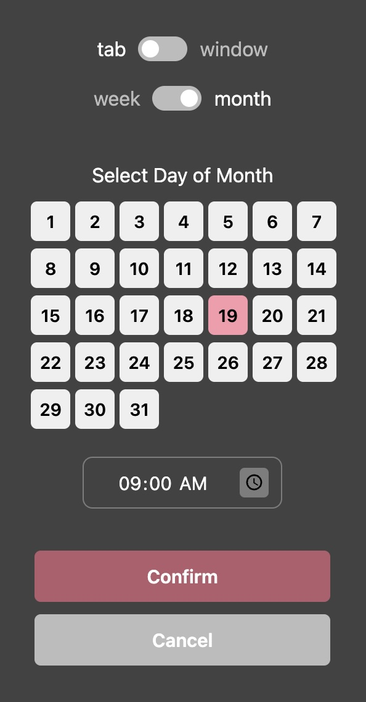
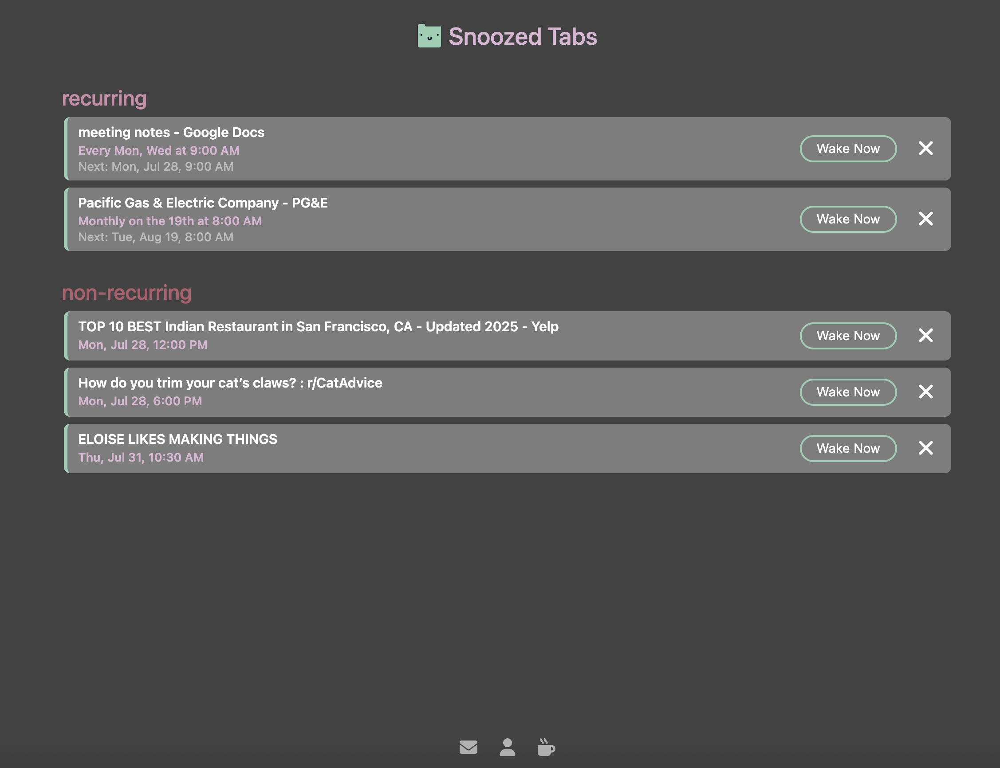

# Tab Snoozey
A Chrome extension that "snoozes" tabs, allowing you to close them and have them re-opened automatically at a specified time. Tab Snoozey also has functionality to snooze whole windows, as well as to set recurring snoozes (e.g. Tuesdays and Thursdays at 9am, or Monthly on the 1st at 5pm).

## Features

### snooze a tab to a pre-set time
Snooze to common times in one click with the list of pre-sets.  

### snooze a tab to a custom time
If no pre-sets match the time you want, select a custom time instead.  

### set a recurring snooze
You can set snoozes that recurr every week, or every month.  

  
  

### view your snoozing tabs
A summary page displays your snoozing tabs, and allows you to wake them up early or delete them.  

### snooze a whole window
To snooze a whole window, use the toggle at the top.  

### don't miss snoozes
A check for overdue snoozes runs so that you don't miss any tabs that were supposed to open while your computer was shut down, etc.

## Permissions Used
These are the only permissions used:
1. **storage**: locally store the URLs and the times they should be reopened. This data doesn't leave your browser!

2. **alarms**: use the Chrome Alarms API to enable waking up tabs at the right time.

3. **tabs**: close the tab when snoozed, and create a new tab with the saved URL at the wake time.

This extension is completely open source! Permissions used can be viewed in the `src/manifest.json` file.

## Support
If you want to support Tab Snoozey and my other projects, you can donate [here](https://buymeacoffee.com/eloiserosen).

